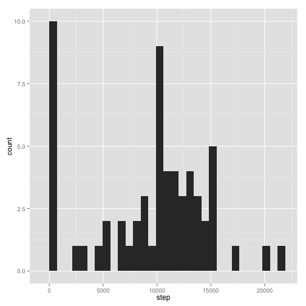
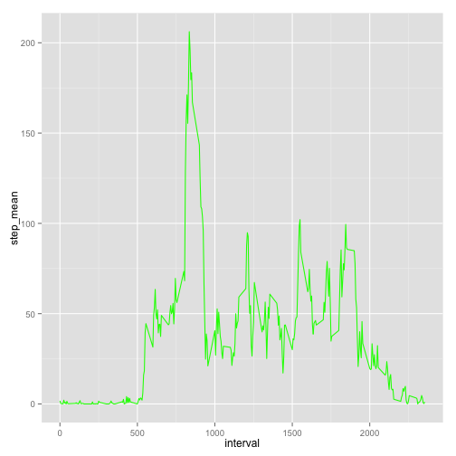
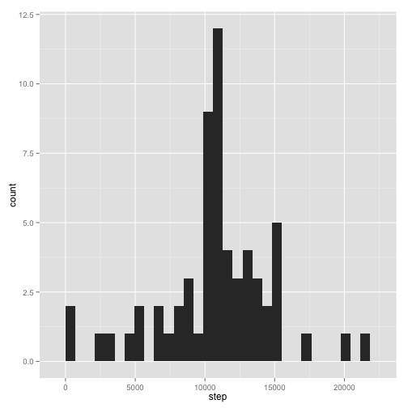
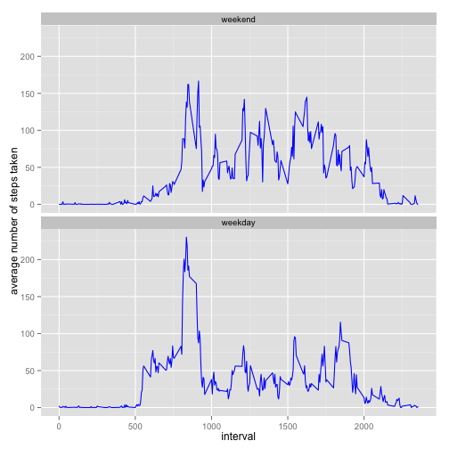

Load the data (i.e. read.csv())


```r
require("ggplot2")
url<-"https://github.com/rdpeng/RepData_PeerAssessment1/blob/master/activity.zip"
temp <- tempfile()
download.file(url, temp)
unzip(temp, "activity.csv")
```

```
## Warning in unzip(temp, "activity.csv"): error 1 in extracting from zip file
```

```r
mydata <- read.csv("activity.csv")
unlink(temp)
```

Make a histogram of the total number of steps taken each day


```r
require(dplyr)
require(plyr)
total_step_day<- ddply(mydata,c("date"), summarise, step=sum(steps, na.rm=TRUE))

qplot(step, data=total_step_day, geom="histogram")
```

```
## stat_bin: binwidth defaulted to range/30. Use 'binwidth = x' to adjust this.
```

 

What is mean total number of steps taken per day?

Calculate and report the mean and median total number of steps taken per day


```r
total_number <- ddply(mydata,"date",summarise,
               Total = sum(steps, na.rm=TRUE))

mean(total_number$Total, na.rm=TRUE)
```

```
## [1] 9354.23
```

```r
median(total_number$Total, na.rm=TRUE)
```

```
## [1] 10395
```


What is the average daily activity pattern?

Make a time series plot (i.e. type = "l") of the 5-minute interval (x-axis) and the average number of steps taken, averaged across all days (y-axis)


```r
newdata <- na.omit(mydata)
average_steps <- ddply(newdata,c("interval"), summarise,
          step_mean = mean(steps, na.rm=TRUE)
          )

ggplot(average_steps, aes(x = interval, y = step_mean)) + geom_line(colour = "green")
```

 

Which 5-minute interval, on average across all the days in the dataset, contains the maximum number of steps?


```r
max_steps <- max(average_steps$step_mean, na.rm=TRUE)
filter (average_steps, step_mean == max_steps)["interval"] 
```

```
##   interval
## 1      835
```

```r
#filter_max["interval"]
```

Imputing missing values

Calculate and report the total number of missing values in the dataset (i.e. the total number of rows with NAs)


```r
summary(mydata)[row =7]
```

```
## [1] "NA's   :2304  "
```

Devise a strategy for filling in all of the missing values in the dataset. The strategy does not need to be sophisticated. For example, you could use the mean/median for that day, or the mean for that 5-minute interval, etc.


```r
# no missing data
filterNa <- filter(mydata, is.na(steps))
```

calculating daliy steps mean


```r
mean_step<- ddply(mydata,c("interval"), summarise, step_mean=mean(steps, na.rm=TRUE))
```

merging day mean data with missing data subset


```r
mergedata <- merge(filterNa,mean_step, by.x = "interval",by.y = "interval")
```

step mean step and rename as steps, date and interval from mergedata


```r
selectNa <- select(mergedata, steps=step_mean,date,interval)
```

Remove NA from mydata and append to selectNa dataset


```r
new_mydata <- na.omit(mydata)

append_data <- rbind(new_mydata, selectNa)
```


Make a histogram of the total number of steps taken each day and Calculate and report the mean and median total number of steps taken per day. Do these values differ from the estimates from the first part of the assignment? What is the impact of imputing missing data on the estimates of the total daily number of steps?


```r
total<- ddply(append_data,c("date"), summarise, step=sum(steps, na.rm=TRUE))

qplot(step, data=total, geom="histogram")
```

```
## stat_bin: binwidth defaulted to range/30. Use 'binwidth = x' to adjust this.
```

 

Calculate and report the mean and median total number of steps taken per day


```r
mean(total$step, na.rm=TRUE)
```

```
## [1] 10766.19
```

```r
median(total$step, na.rm=TRUE)
```

```
## [1] 10766.19
```

For this part the weekdays() function may be of some help here. Use the dataset with the filled-in missing values for this part.

Create a new factor variable in the dataset with two levels – “weekday” and “weekend” indicating whether a given date is a weekday or weekend day.


```r
append_data['daysofweek'] <- weekdays(as.Date(append_data$date))

weekday <- c('Monday', 'Tuesday', 'Wednesday', 'Thursday', 'Friday')
append_data['weekday']<- factor((append_data$daysofweek %in% weekday), 
                   levels=c(FALSE, TRUE), labels=c('weekend', 'weekday'))


head(append_data)
```

```
##     steps       date interval daysofweek weekday
## 289     0 2012-10-02        0    Tuesday weekday
## 290     0 2012-10-02        5    Tuesday weekday
## 291     0 2012-10-02       10    Tuesday weekday
## 292     0 2012-10-02       15    Tuesday weekday
## 293     0 2012-10-02       20    Tuesday weekday
## 294     0 2012-10-02       25    Tuesday weekday
```


Make a panel plot containing a time series plot (i.e. type = "l") of the 5-minute interval (x-axis) and the average number of steps taken, averaged across all weekday days or weekend days (y-axis). See the README file in the GitHub repository to see an example of what this plot should look like using simulated data.


```r
time_series<- ddply(append_data,c("interval","weekday"), summarise, step=mean(steps, na.rm=TRUE))

p <- ggplot(time_series, aes(x=interval, y=step))
p <- p + geom_line(colour = "blue")
p <- p+ facet_wrap(~weekday,ncol = 1)
p+ ylab("average number of steps taken")
```

 
